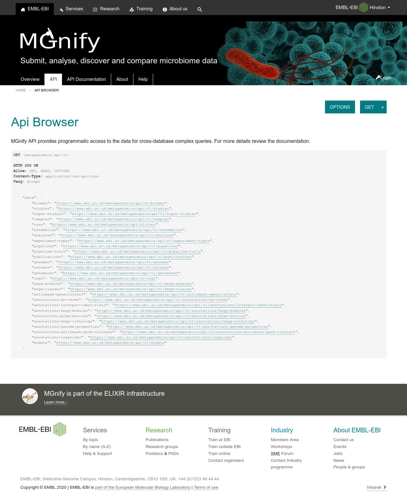
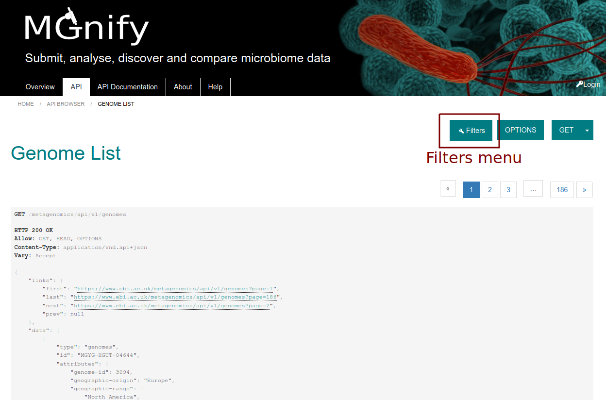
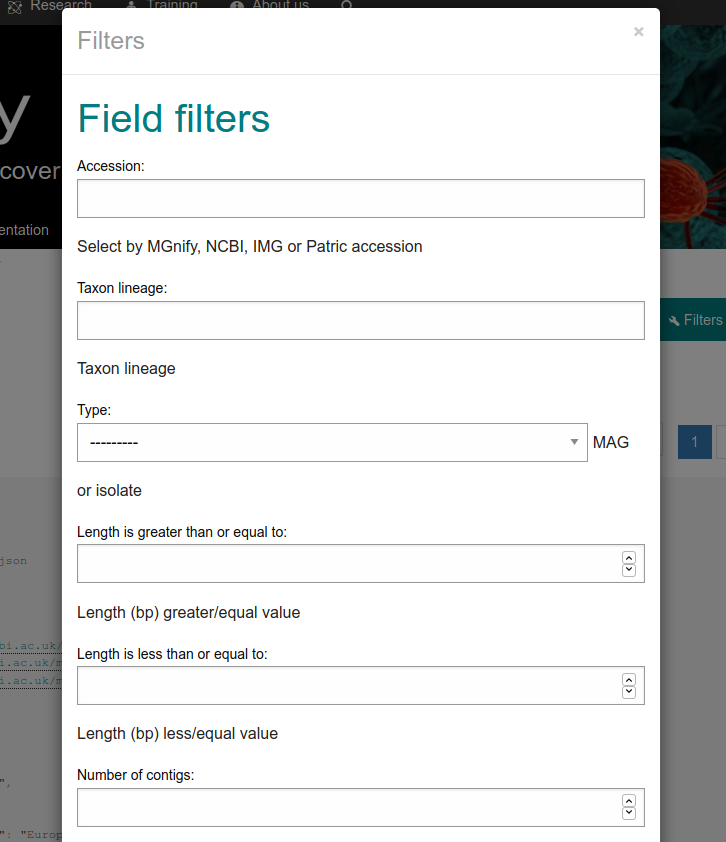
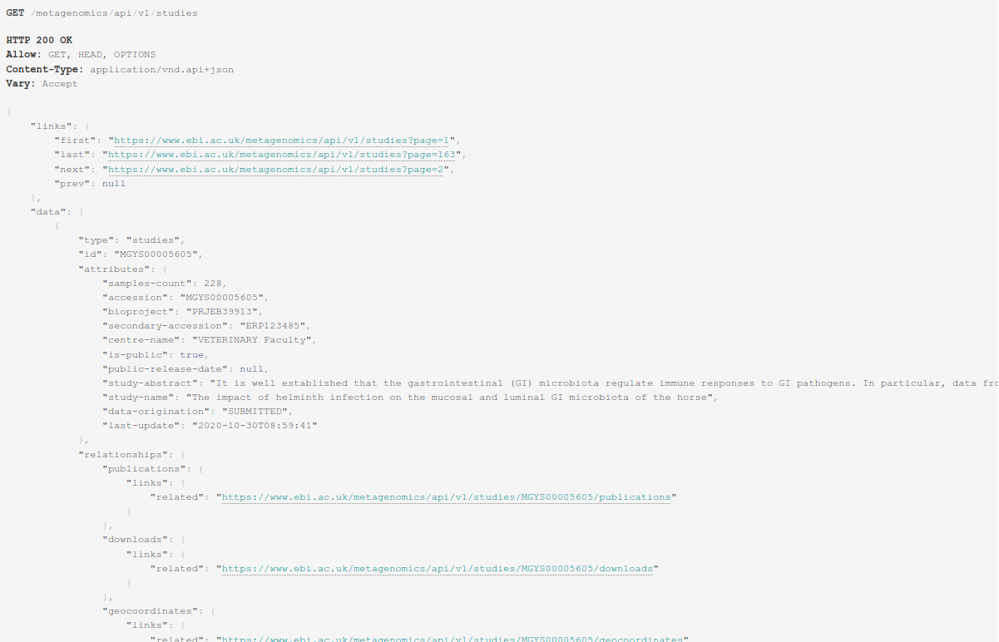
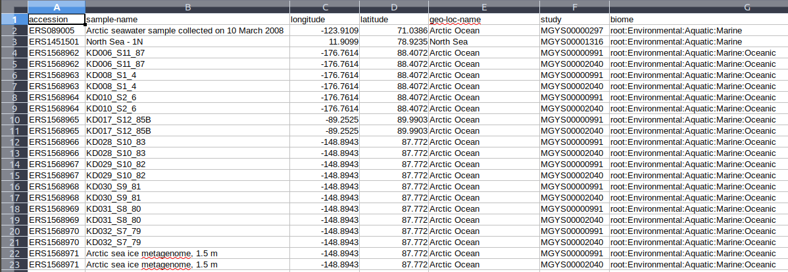
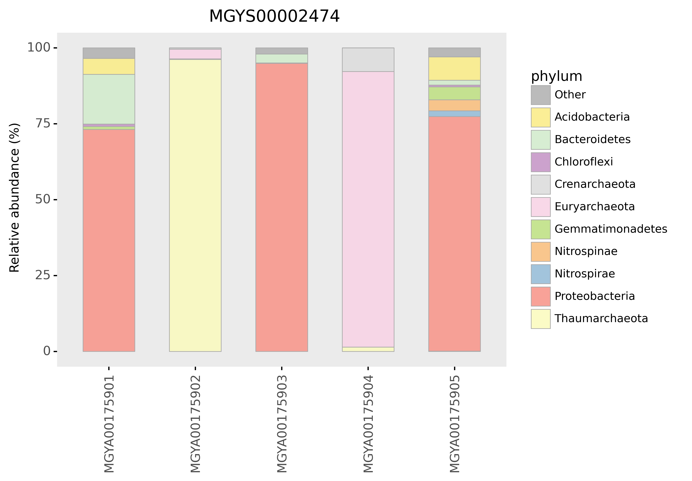

********************
MGnify API data hunt
********************

This tutorial provides an introduction to the API (Application Programming Interface) and tools & methods 
that can be used to access microbiome data programmatically from MGnify. You will learn about the structure 
of the API and the data, as well as how to write scripts to analyze data programmatically.

Learning objectives
###################

- Understand how to access data using MGnify API
- Understand how to filter data sets using metadata
- Learn how to write scripts to programmatically access to the data

Prerequisites
#############

For this tutorial you will need a working directory to store that data. 
The first step is to create a folder in your home directory (~/).

Open the terminal and execute the following instructions:

.. code-block:: bash

   mkdir -p ~/Mgnify2020/session_api/
   cd ~/Mgnify2020/session_api/

An introduction to MGnify REST API
##################################

MGnify is a freely avaiable hub for the analysis and exploration of metagenomic, metatranscriptomic,
amplicon and assembled datasets. The resource provides rich functional and taxonomic analyses of
user-submitted sequences, as well as analysis of publicly avaiable metagenomic datasets drawn
from the European Nucleotide Archive (ENA).

How to browse data using MGnify REST API
****************************************

The MGnify REST API allows retrieval of over 400.000 (and counting) publicy
avaiable metagenomics, metatranscriptomic, amplicon and assembly datasets,
sampled from diverse environments.

The base URL to the API is: https://www.ebi.ac.uk/metagenomics/api

The API documentation at: https://www.ebi.ac.uk/metagenomics/api/docs

   **Figure 1**: MGnify API browser.

The base URL provides access to several resource collections, such as *studies*
**samples**, **runs**, **analyses**, **genomes**, **biomes** and **experiment-types**

|action|\  Open https://www.ebi.ac.uk/metagenomics/api/latest/studies in your browser. This will a paginated list of all of the publicy available studies. Now open the list of samples using: https://www.ebi.ac.uk/metagenomics/api/latest/samples

|question|\  Question 1: What kind of experiment types can be found in MGnify?. Hint: follow the relavant link on: https://www.ebi.ac.uk/metagenomics/api and examine the variuos experiment type identifiers.

|info|\  Details about a single project can be retrieved by providing a unique identifier assigned during the archiving process. For example, https://www.ebi.ac.uk/metagenomics/api/latest/studies/ERP009703 provides access to the Ocean Sampling Day (OSD) 2014 project.

|action|\  Retrieve the list of samples contained in this study using the following URL: https://www.ebi.ac.uk/metagenomics/api/latest/studies/ERP009703/samples. Explore the response, at the bottom of the page you can find the number of pages that match this query.

|action|\  Now, retrieve all the analyses performed on this study using: https://www.ebi.ac.uk/metagenomics/api/latest/studies/ERP009703/analyses.

|question|\  Question 2: Is the number of samples the same as the number of analyses?. What could be the reason?

|info|\  Parameters can be added to the URL to filter and sort the data, allowing the construction of more complex queries. The API browser lists the filters that are avaiable, as ilustrated in Figures 2 and 3.

   
   **Figure 2**: Filters menu in MGnify API browser.

   
   **Figure 3**: Filters pop up menu for the Genomes list endpoint.

|question|\  Question 3: Using the API browser, how many results have been analysed with the pipeline version 4.0 for the OSD study ERP009703?

Programmatic access
###################

In the next few exercies we are going to utilize some Python scripts to interact with the MGnify REST API programmatically. 

The first step is to create the conda environment using `miniconda <https://docs.conda.io/en/latest/miniconda.html>`_.

You will also need the dependencies and to install execute the following commands:

.. code-block:: bash

   conda create -n mgnify-api python=3.8

   conda activate mgnify-api

   pip install pandas numpy scipy plotnine jsonapi-client mg-toolkit requests

The next step is to obtain the scripts and expected results for each exercise the course FTP server.

.. code-block:: bash

   curl http://ftp.ebi.ac.uk/pub/databases/metagenomics/mgnify_courses/ebi_2020/api.tar.gz | tar xz --strip 1

The data and scripts are also avaiable in the `source code of this documentation <https://github.com/EBI-Metagenomics/mgnify-ebi-2020/tree/master/docs/source/scripts/api>`_.

Data exchange format
********************

The industry default data exchange format for Web API is JSON. This format is a compact and human-readable way of representing data. A brief overview of the format `json <https://www.digitalocean.com/community/tutorials/an-introduction-to-json>`_.

The MGnify REST API returns a JSON object formatted data structure that contains the resource type, associated object identifier, attributes and relationships to other resources, allowing the construction of complex queries.

   
   **Figure 4**: MGnify response output in JSON format.

Standardized format data structures allow third party libraries in many programing languages to easily access data programmatically.

Exercise 1
**********

In this exercise you will browse sample metadata and visualise analysis results. First we are going to look at retrieving samples that match particular metadata search criteria.

|action|\  Read the code of the `exercise1.py <https://github.com/EBI-Metagenomics/mgnify-ebi-2020/blob/master/docs/source/scripts/api/exercise1.py>`_ script. This script is using the API to obtain a subset of the samples.

|question|\  Question 4: What "type" of data is the script downloading?. Which filters are being used to get the filtered data from the API?.

|info|\  Using these few lines of Python, we are able to retrieve the complete set of oceanographic samples taken at Arctic Ocean (latitude > 70)
across all publicly available studies in MGnify.

|action|\  Run the script `exercise1.py`_ in the console:

.. code-block:: bash

   python exercise1.py

|action|\  Inspect the generated `exercise1.csv <https://github.com/EBI-Metagenomics/mgnify-ebi-2020/blob/master/docs/source/data/api/exercise1.csv>`_ file.

   
   **Figure 5**: Exercise 1 retrieved data in CSV format.

|question|\  Question 5: How might you adapt the script to find soil samples taken at the equator?.

|action|\  Add an additional parameter '"study_accession": "MGYS00000462"' to the filters section in the script and run it again. You can check the study in the website `MGYS00000462 <https://www.ebi.ac.uk/metagenomics/studies/MGYS00000462>`_.

|question|\  Question 6: How many of the OSD2014 samples were from the Artic Ocean?

Exercise 2
**********

For this exercise we will use the MGnify REST API to obtain data and then visualize the analysis results of the study "Metabolically active microbial communities in marine sediment under high-CO2 and low-pH extremes MGYS00002474 (DRP001073). In this study, DNA was extracted from sub-seafloor sediments and domain specific 16S rRNA gene primers were used to profile the archaeal and bacterial taxonomic communities.

We will begin by retrieving taxonomic analysis data and then plotting relative abundance in the form of bar charts.

|action|\  Open the file `exercise2.py <https://github.com/EBI-Metagenomics/mgnify-ebi-2020/blob/master/docs/source/scripts/api/exercise2.py>`_. Read the code, even if you don't understand python the variables and constants at the beginnnig of the file will allow the script to be easily modified. Note, there are a series study accessions that are currently commented out which will allow you to rerun the analysis with other projects. Ignore there for the time being and run the code with MGYS00002474 and inspect the resultant bar chart.

.. code-block:: bash

   python exercise2.py

   
   **Figure 6**: Microbiome diversity in the study MGYS00002474 (DRP001073) at the phylum level.

|question|\  Question 7: How similar or different are the phylum compositions of each analysis?. How might you explain any differences?.

|question|\  Question 9: How many of the analyses look to target bacterial populations and how many are targeting the archaea?

|info|\  It's easy to adapt the script for other analyses. For example, if you change the variable TAX_RANK (line 13 in `exercise2.py`_) to "genus" you can obtain the genus level results.

|question|\  Question 10: How might you adapt the code for the analysis of other studies:
* perform analysis of taxonomic results bases on the large ribosomal subunit rRNA or the ITS region for fungi?
* output the top 20 genera, rather that the top 10?
* display functional analysis results (InterProScan or Gene Ontology terms)?

Exercise 3
**********

For this exercise we will use the MGnify REST API and the MG-Toolkit to download analysis files. `MG-Toolkit <https://pypi.org/project/mg-toolkit/>`_ is a Python command line application that allows download all of the sample metadata for a given study or sequence to a single csv file. At the moment of writing this the toolkit doesn't support MGnify genomes, for this resource we will use the MGnify REST API.

|info|\  We installed the toolkit when we created the conda environment.

|question|\  Question 13: What type of data can we download using the Toolkit?.

|action|\  Let's download the functional annotations for one study. Please, run the following commands:

.. code-block:: bash

    mg-toolkit -d bulk_download -a MGYS00005575 --result_group pathways_and_systems

|info|\  This may take a few minutes.

|question|\  Question 14: Based on the files the toolkit has downloaded, how many analyses has the study MGYS00005575?.

|info|\  For the genome resource we will use the API directly to obtain all the Download files for the genome: MGYG-HGUT-04644

|action|\  Open the file `exercise3.py <https://github.com/EBI-Metagenomics/mgnify-ebi-2020/blob/master/docs/source/scripts/api/exercise3.py>`_. Read the code. This script will download all the files from the downloads relationship for the selected genome.

Execute the script to fetch the files:

.. code-block:: bash

   python exercise3.py

|action|\  Explore the different files that were downloaded.

|question|\  How could you modify the script to download the other functional annotations?.

.. |info| image:: media/info.png
   :width: 0.26667in
   :height: 0.26667in
.. |action| image:: media/action.png
   :width: 0.26667in
   :height: 0.26667in
.. |question| image:: media/question.png
   :width: 0.26667in
   :height: 0.26667in
