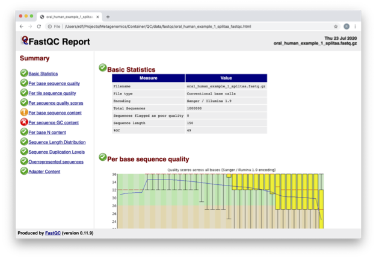
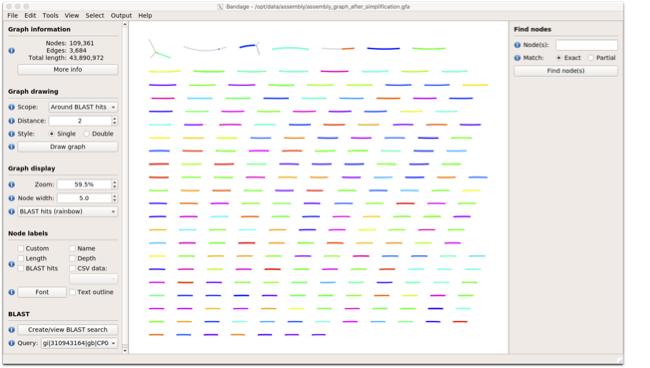

***************
Assembling data
***************

- What constitutes a good assembly?
- How to estimate assembly quality
- Co-assembly

Assembly and Co-assembly
----------------------------------

|image1|\ Learning Objectives - in the following exercises you will
learn how to perform a metagenomic assembly and to start some basic
analysis of the output. Subsequently, we will demonstrate the
application of co-assembly. Note, due to the complexity of metagenomics
assembly, we will only be investigating very simple example datasets as
these often take days of CPU time and 100s of GB of memory. Thus, do not
think that there is an issue with the assemblies.

Once you have quality filtered your sequencing reads, you may want to perform *de novo* assembly in addition to, or
as an alternative to a read-based analyses. The first step is to
assemble your sequences into contigs. There are many tools available for
this, such as MetaVelvet, metaSPAdes, IDBA-UD, MegaHIT. We generally use
metaSPAdes, as in most cases it yields the best contig size statistics
(i.e. more continguous assembly) and has been shown to be able to
capture high degrees of community diversity (Vollmers, et al. PLOS One
2017). However, you should consider the pros and cons of different
assemblers, which not only includes the accuracy of the assembly, but
also their computational overhead. Compare these factors to what you
have available. For example, very diverse samples with a lot of
sequence data uses a lot of memory with SPAdes. In the following
practicals we will demonstrate the use of metaSPAdes on a small sample
and the use of MEGAHIT for performing co-assembly.

|image1|\ Let's first change to the working directory where will be running the analyses:

.. code-block:: bash

    cd /home/training/Data/Assembly

|image2|\ To run metaspades you would execute the following commands: 

.. code-block:: bash

    mkdir assembly
    metaspades.py -t 2 --only-assembler -m 10 -1 reads/oral_human_example_1_splitaa_kneaddata_paired_1.fastq -2 reads/oral_human_example_1_splitaa_kneaddata_paired_2.fastq -o assembly

|image2|\ However, since the assembly process would take ~1h we are just going to analyse the output present in assembly.bak. Let's look at the contigs.fasta file.  

Now take the first 40 lines of the sequence and perform a blast search
at NCBI (https://blast.ncbi.nlm.nih.gov/Blast.cgi, choose
Nucleotide:Nucleotide from the set of options). Leave all other options
as default on the search page. To select the first 40 lines of sequence
perform the following:

.. code-block:: bash

    head -41 assembly.bak/contigs.fasta

|image8|\

|image3|\ Which species do you think this sequence may be coming from?
Does this make sense as a human oral bacteria? Are you surprised by this
result at all?  

|image2|\  Now let us consider some statistics about the entire assembly

.. code-block:: bash

    assembly_stats assembly.bak/scaffolds.fasta

|image1|\ This will output two simple tables in JSON format, but it is
fairly simple to read. There is a section that corresponds to the
scaffolds in the assembly and a section that corresponds to the contigs.

|image3|\ What is the length of longest and shortest contigs? 

|image3|\ What is the N50 of the assembly? Given that are input
sequences were ~150bp long paired-end sequences, what does this tell you
about the assembly?

|image1|\ N50 is a measure to describe the quality of assembled genomes
that are fragmented in contigs of different length.  We can apply this
with some caution to metagenomes, where we can use it to crudely assess
the contig length that covers 50% of the total assembly.  Essentially
the longer the better, but this only makes sense when thinking about
alike metagenomes. Note, N10 is the minimum contig length to cover 10
percent of the metagenome. N90 is the minimum contig length to cover 90
percent of the metagenome.

|image2|\ Bandage (a Bioinformatics Application for Navigating De novo
Assembly Graphs Easily), is a program that creates interactive
visualisations of assembly graphs. They can be useful for finding
sections of the graph, such as rRNA, or to try to find parts of a
genome. Note, you can install Bandage on your local system. With
Bandage, you can zoom and pan around the graph and search for sequences,
plus much more. The following guide allows you to look at the assembly
graph.  Normally, I would recommend looking at the ‘
assembly_graph.fastg, but our assembly is quite fragmented, so we will
load up the assembly_graph_after_simplification.gfa.   

|image2|\  At the terminal, type 

    Bandage

In the the Bandage GUI perform the following

    Select File->Load graph

    Navigate to  /home/training/Data/Assembly/files/assembly.bak/ and select on assembly_graph_after_simplification.gfa

Once loaded, you need to draw the graph. To do so, under the “Graph
drawing” panel on the left side perform the following:

    Set Scope to 'Entire graph'
     
    The click on Draw graph

|image2|\ Use the sliders in the main panel to move around and look at
each distinct part of the assembly graph.

|image3|\ Can you find any large, complex parts of the graph? If so,
what do they look like. 

|image2|\  In this particular sample, we believe that strains related to
the species *Rothia dentocariosa,* a Gram-positive, round- to rod-shaped
bacteria that is part of the normal community of microbes residing in
the mouth and respiratory tract, should be present in our sample. While
this is a tiny dataset, lets try to see if there is evidence for this
genome. To do so, we will search the *R. dentocariosa* genome against
the assembly graph.

To do so, go to the “BLAST” panel on the left side of the GUI.

    Step 1 - Select Create/view BLAST search, this will open a new window    
    
    Step 2 - select build Blast database
    
    Step 3 - Load from FASTA file -> navigate to the genome folder /home/training/Data/Assembly/files/genome and select GCA_000164695.fasta
    
    Step 4 - modify the  blast filters to 95% identity
    
    Step 6 - run blast
    
    Step 7 - close this window

To visualise just these hits, go back to "Graph drawing” panel. 

    Set Scope to ‘Around BLAST hits’
    
    Set Distance 2
    
    The click on Draw graph

You should then see something like this:

|image9|\

|image1|\ In the following steps of this exercise, we will look at
performing co-assembly of multiple datasets. Due to computational
limitations, we can only look a example datasets.  However, the
principles are the same. We have also pre-calculated some assemblies for
you. In the co-assembly directory, there are already 2 assemblies.  We
have a single paired-end assembly. 

.. code-block:: bash

    megahit -1 reads/oral_human_example_1_splitac_kneaddata_paired_1.fastq -2 reads/oral_human_example_1_splitac_kneaddata_paired_1.fastq -o  coassembly/assembly1 -t 2 --k-list 23,51,77 

|image2|\  Now run the assembly_stats on the contigs for this assembly.

.. code-block:: bash

   assembly_stats coassembly/assembly1/final.contigs.fa

|image3|\  How do these differ to the ones you generated previously? What may account for these differences?

|image1|\ We have also generated the first coassembly using MegaHIT.
This was produced using the following command.  To specify the files, we
put all of the forward file as a comma separated list, and all of the
reversed as a comma separated list, which should be ordered that same in
both, such that the mate pairs match up.

.. code-block:: bash

    megahit -1 reads/oral_human_example_1_splitac_kneaddata_paired_1.fastq,reads/oral_human_example_1_splitab_kneaddata_paired_1.fastq  -2 reads/oral_human_example_1_splitac_kneaddata_paired_1.fastq,reads/oral_human_example_1_splitab_kneaddata_paired_2.fastq -o coassembly/assembly2 -t 2 --k-list 23,51,77 

|image2|\  Now perform another co-assembly, depending on the computer
you have, either change one of the previous fastq files for the 

.. code-block:: bash

    megahit -1 reads/oral_human_example_1_splitab_kneaddata_paired_1.fastq,reads/oral_human_example_1_splitac_kneaddata_paired_1.fastq,reads/oral_human_example_1_splitaa_kneaddata_paired_1.fastq -2 reads/oral_human_example_1_splitab_kneaddata_paired_2.fastq,reads/oral_human_example_1_splitac_kneaddata_paired_2.fastq,reads/oral_human_example_1_splitaa_kneaddata_paired_2.fastq -o coassembly/assembly3 -t 2 --k-list 23,51,77   

|image1|\ This takes about 20-30 minutes.

|image2|\ You should now have three different assemblies, two provide
and one generated by yourselves. Now let us compare the assemblies.

.. code-block:: bash

    assembly_stats coassembly/assembly1/final.contigs.fa
    assembly_stats coassembly/assembly2/final.contigs.fa
    assembly_stats coassembly/assembly3/final.contigs.fa

|image1|\ We only have contigs.fa from MEGAHIT, so the contigs and
scaffold sections are the same.

|image3|\  Has the assembly improved? If so how?

.. |image1| image:: media/info.png
   :width: 0.26667in
   :height: 0.26667in
.. |image2| image:: media/action.png
   :width: 0.26667in
   :height: 0.26667in
.. |image3| image:: media/question.png
   :width: 0.26667in
   :height: 0.26667in

.. |image5| image:: media/fastqc2.png
   :width: 6.26389in
   :height: 4.30833in
.. |image6| image:: media/multiqc1.png
   :width: 6.26389in
   :height: 4.30833in
.. |image7| image:: media/multiqc2.png
   :width: 6.26389in
   :height: 4.30833in
.. |image8| image:: media/blast.png
   :width: 6.26389in
   :height: 3.86181in

